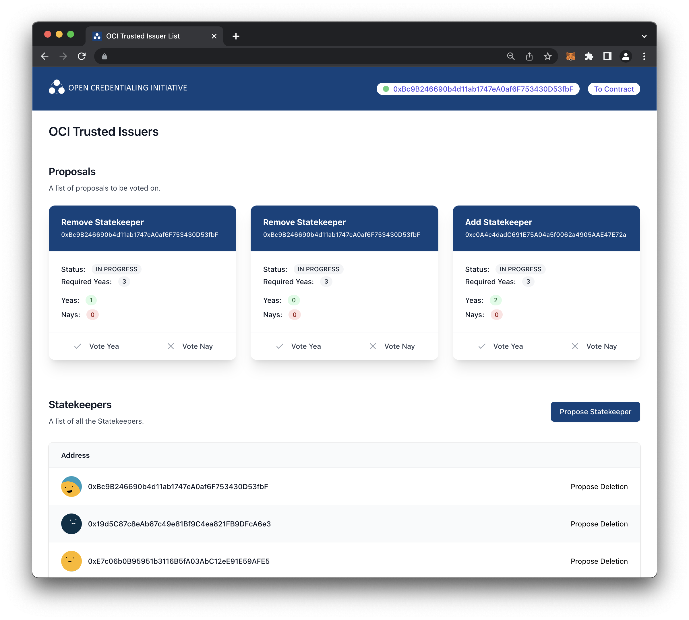

    
    

---

## Introduction

In a trusted and regulated ecosystem, a list of trusted issuing parties is needed. For this purpose, the OCI defined a secure, always-available, and self-governing mechanism to manage and retrieve a list of trusted Decentralized Identifiers (DIDs) belonging to trusted issuers. These issuers are trusted with issuing ATP and identity credentials while observing all needed regulations.

For this purpose, an open, trustless, and decentralized network that is able to run arbitrary programs was chosen: The Ethereum network. The programs you can run on it are called "Smart Contracts". Those are self-contained programs that can store and manipulate their state.

This repository contains code and documentation for a trusted issuer registry smart contract and a frontend that connects to it.

## Goals

The chosen approach aims to enforce the following policies:

- Always available: Calling the trusted issuer list is an integral part while verifying ATP or identity credentials, so it should be always available.
- Trustless: The architecture and the execution of the trusted issuer registry should not be owned and controlled by a single entity.
- Transparent: The code, state, and executions of the trusted issuer registry should be transparent to all parties in the ecosystem.
- Auditability: It should be possible to retrieve a previous state of the trusted issuer registry.
- Security: Changes to the trusted issuer registry should only be made by trusted entities. For this, a governance protocol is defined which relies on strong cryptography enforce by the Ethereum network.

## Architecture

The smart contract containing the trusted issuer registry is deployed to the Ethereum blockchain and acts as a backend. Its state and methods can be accessed via an Ethereum node, e.g., an OCI-owned one, that exposes all needed RPC methods or a service like [Infura](https://infura.io/).

The following two sections will go into more detail on what both the smart contract and the frontend do and how they work.

### Smart Contract

The main goal of the smart contract is to store and manage the list of trusted issuers under the terms of a governance protocol. A governance protocol is needed to make sure that only trusted entities can:
- Change the list of trusted issuers
- Vote on the list of entities that can change the list of trusted issuers

The trusted entities that can manage the trusted issuer list are called "Statekeepers". Those can do the following:
- Add/ remove a trusted issuer DID (no voting required)
- Create a voting proposal to add/ remove a Statekeepers (80% approval of all Statekeepers needed)
- Create a voting proposal to change approval rates (100% approval of all Statekeepers needed)
- Vote for proposals (yea or nay)
- Enforce a voting proposal if enough Statekeepers approved it

If a voting proposal got enough approvals, a Statekeeper can instruct the smart contract to enforce the proposal. This could be adding/ removing a trusted issuer DID or a Statekeeper from the contract state.

The officially deployed versions of the trusted issuer registry can be found here:
- [Production (Mainnet, no deployed yet)](#)
- [Development (Ropsten)](https://ropsten.etherscan.io/address/0x158b6823b7D5225f9B250389bd44d4077046D608)
- [Development (Ropsten, without governance)](https://ropsten.etherscan.io/address/0x4a678c5aa932dfbcc0def48114e7d5e66720a637)

### Frontend

The frontend is an easy-to-use web application that connects to the Smart Contract. Its purpose is to allow Statekeepers to easily add/ remove trusted issuer DIDs, create proposals, and vote on proposals in an easily digestible GUI.

It is a React app that uses web3.js to connect to an Ethereum wallet in the form of MetaMask. MetaMask is the bridge between the frontend and the smart contract on the Ethereum network and allows to retrieve or modify the state of the contract. Modifications happen in the form of transactions to the smart contract that are signed and send via MetaMask in a user-friendly way to the Ethereum blockchain. 

MetaMask keeps track of all your Ethereum accounts, their transactions, and has a direct connection to the Ethereum blockchain. OCI Statekeepers are obligated to use a so-called hardware wallet in combination with MetaMask. In this case, a physical device stores the private keys of your Ethereum accounts and also signs transactions. In this mode, MetaMask only forwards your signed transactions to the Ethereum blockchain. This a needed security measure to prevent the leaking of private keys with which potential rouge actors could illegally modify the trusted issuer list.

The officially hosted frontends can be found here:
- [Trusted Issuer Registry Dashboard](https://ropsten-trusted-issuers.netlify.app/)
- [Trusted Issuer Registry Dashboard (alt)](https://ropsten-trusted-issuers.vercel.app/)

---

## 🤝 Contributing

OCI encourages contributions from OCI member and non-member companies and individuals. 
Please send issues and pull requests by following our processes and agreements. Feel free to check the issues page.

**By contributing, companies and individuals certify the assertions made in the [Developer's Certificate of Origin](https://developercertificate.org/).**

## 🏷️ Licence

By submitting their contribution to OCI, the contributor certifies that they have the right to submit it under the open source license indicated here.

**This project is [Apache 2.0](http://www.apache.org/licenses/LICENSE-2.0)-licensed.**

You may not use this file except in compliance with the License.
You may obtain a copy of the License at

   [http://www.apache.org/licenses/LICENSE-2.0](http://www.apache.org/licenses/LICENSE-2.0)

Unless required by applicable law or agreed to in writing, material
distributed under the License is distributed on an "AS IS" BASIS,
WITHOUT WARRANTIES OR CONDITIONS OF ANY KIND, either express or implied.
See the License for the specific language governing permissions and
limitations under the License.

Copyright © 2022 Named editors. Contributors to [OCI](https://www.oc-i.org/).
